# Stock Analysis Project

## Overview

This project aims to develop a comprehensive stock analysis report that includes trend analysis, predictions, and investment recommendations.

## Setting Up the Environment

### Step 1: Setting Up `pyproject.toml`

The `pyproject.toml` file turns all the requirements of our project into code, so we can run an install script to package and build all the necessary dependencies.

1. **Install Poetry**:
    ```sh
    pipx install poetry
    ```

2. **Install pipx**:
    ```sh
    py -m pip install --user pipx
    ```

3. **Create `pyproject.toml`**:
    - Define core components under `[tool.poetry]` such as `name` and `description`.
    - Specify dependencies required for the project.
    - Use `tool.pyright` to check Python codes for type errors.
    - Use `tool.ruff` to check for errors and styling issues.
    - Define `build-system` to use Poetry version.

### Step 2: Install Dependencies

Open the terminal and run:
```sh
poetry install --no-root
```

### Step 3: Check Python Version

Check the currently used Python version for your Poetry environment:
```sh
poetry env list
```

### Step 4: Enter Poetry Environment

Enter into the Poetry environment:
```sh
poetry shell
```

After this, you will have a Python environment in which you can work.


## Cheat Sheet to Make a Good Agent

### General Guidelines:
- **Begin with the end in mind**: Identify the specific outcome your tasks are aiming to achieve.
- **Break down the outcome into actionable tasks**: Assign each task to the appropriate agent.
- **Ensure the tasks are descriptive**: Provide clear instructions and expected deliverables.

### Project Goal
Develop a comprehensive stock analysis report that includes trend analysis, predictions, and investment recommendations.

### Key Roles
**Captain/Manager/Boss**

**Role**: Expert Stock Analyst
- **Responsibilities**: Oversees the entire stock analysis project.
- **Goal**: Ensure the final report is accurate, comprehensive, and actionable.
- **Backstory**: Experienced stock analyst with a background in financial markets and data analysis.

### Employees/Experts to Hire
**Data Collection Specialist**

**Role**: Collects relevant stock data from various sources.
- **Goal**: Gather comprehensive and accurate data for analysis.
- **Backstory**: Proficient in web scraping, API usage, and data gathering techniques.

**Data Cleaning Expert**

**Role**: Cleans and preprocesses the collected data.
- **Goal**: Ensure the data is clean, consistent, and ready for analysis.
- **Backstory**: Experienced in data cleaning and preprocessing with strong attention to detail.

**Data Visualization Expert**

**Role**: Creates visual representations of the data.
- **Goal**: Develop insightful charts and graphs to visualize trends and patterns.
- **Backstory**: Skilled in data visualization tools like Matplotlib, Seaborn, and Plotly.

**Prediction Model Specialist**

**Role**: Builds and trains predictive models.
- **Goal**: Develop accurate models to predict stock trends and prices.
- **Backstory**: Proficient in machine learning and statistical modeling techniques.

**Investment Advisor**

**Role**: Provides investment recommendations based on analysis.
- **Goal**: Offer actionable investment advice to maximize returns.
- **Backstory**: Experienced financial advisor with a deep understanding of stock markets and investment strategies. 


## SOME QUERIES TO BE ANSWERED

The project is not using traditional machine learning models like ANN (Artificial Neural Networks) or CNN (Convolutional Neural Networks). Instead, it leverages pre-existing AI tools and APIs to perform various tasks such as web scraping, financial calculations, and document analysis.

### Which model would be optimal to train the model and get the output and why?

Given the nature of this project, which involves financial data analysis, market trend interpretation, and investment recommendations, a traditional machine learning model is not necessarily optimal. Instead, using pre-trained models and APIs like those provided by LangChain, SEC API, and other specific tools is more effective. These tools are designed to handle specific tasks like data scraping, document parsing, and embeddings for document similarity.
If we were to incorporate a custom model, we might consider:
**Natural Language Processing (NLP)** models for text analysis and summarization.
**Time Series Analysis models** for financial trend prediction.
**Ensemble Models** that combine multiple approaches for more robust predictions.

### this project using an LLM (Large Language Model)

The project utilizes LLMs through the LangChain library and specific tools like the **YahooFinanceNewsTool** and the custom agents defined in stock_analysis_agents.py. These tools and agents use pre-trained language models to perform tasks like **summarizing web content, searching the internet, and analyzing financial documents**.

## THE PROJECT CAN BE CHANGED TO "LLM-Powered Financial Analysis"

## SOME RESEARCH WORKS TO SUPPORT THE IDEAS OF THIS PROJECT

1. **"A Multi-agent Q-learning Framework for Optimizing Stock Trading Systems"** by Jae Won Lee and Jangmin O. This paper explores the use of a multi-agent system combined with Q-learning techniques to optimize stock trading strategies. It emphasizes the integration of reinforcement learning to enhance decision-making in trading environments, aligning well with the project on using agents for stock analysis and recommendation​.
link to the paper : [https://link.springer.com/chapter/10.1007/3-540-46146-9_16](url)

2. **"Using Multi-agent Systems Simulations for Stock Market Predictions"** by Diana Dezsi, Emil Scarlat, and Iulia Mărieş. This study presents an agent-based simulation approach for predicting stock market trends. It highlights how different agents can represent various market participants and interact to simulate realistic market conditions, which can improve the accuracy of stock market predictions and analyses​.
link to paper : [https://link.springer.com/chapter/10.1007/978-3-319-05458-2_6](url)


## Explanation of the code 

1. There are 3 agents : **Research Analyst Agent**, **Financial Analyst Agent**, **Investment Advisor Agent**, Stock Analysis Report 
    -*The Financial Analyst Agent*: To impress all customers with the financial data and market analysis.
    -*The Research Analyst Agent*: To being the best at gathering information, interpreting data and amazing the customer with it.
    -*The Investment Advisor Agent*: To Impress the customers with full analyses over stocks and complete the investment recommendations.

2. Each agent have some tools provided to work with it. These tools are being imported in the starting lines.

3. There is a folder called **Tools** thats where all the tools exist. 
    -*The Browser Tools*: will be used to scrape website content.
    -*The Calculator Tools*: will be used to make any mathematical calculations.
    -*The Search Tools*: will be used to search the internet.
    -*The Sec Tool*: will be used to search 10Q forms.
    -**YAHOO FINANCE NEWS TOOLS**: used to collect the latest finance news from the news tool.

4. Now lets summarize the tasks to be performed by the agents:
    -*The Research Task*: to collect and summarize recent news articles 
    -*The Financial Analysis*: to conduct a thorough analysis of the stock's financial health and market performance.
    -*The Filings Analysis*: to analyze the latest filings
    -*The Recommend Task*: to review and synthesize the analysis provided by the financial and research analysts

5. The code in main.py is Python application creates a graphical user interface (GUI) for financial analysis using the `customtkinter` library. The application allows users to input a company name, analyze its financial data, and visualize the results through various types of charts (e.g., bar charts, pie charts, histograms, and sentiment line charts).

    ### Key Components of the Application

    #### Libraries and Modules

    - **customtkinter as ctk**: A modernized version of the Tkinter library, used to create the GUI.
    - **threading**: Allows for running functions in separate threads, enabling asynchronous operations (like fetching financial data).
    - **matplotlib.pyplot and FigureCanvasTkAgg**: Used to create and display graphs within the GUI.
    - **Crew, StockAnalysisAgents, StockAnalysisTasks**: Modules related to a custom financial analysis library named `crewAI`.
    - **dotenv**: Used to load environment variables from a `.env` file.
    - **parse_input**: A function from a custom module `graph_ai.py` that processes user input for generating graphs.

    #### Classes

    1. **FinancialCrew**: Handles the financial analysis logic. It initializes with a company name and runs a series of tasks to gather financial data and provide a summary.
    2. **FinancialAnalysisApp**: The main GUI application class, inheriting from `ctk.CTk` (a custom Tkinter class). This class sets up the GUI layout, handles user interactions, and integrates the analysis logic provided by the `FinancialCrew` class.

    ### Detailed Explanation of the Code

    #### FinancialCrew Class

    ##### `__init__` Method

    - Initializes the class with a `company` parameter, storing the company name for analysis.

    ##### `run` Method

    - Initializes agents and tasks using `StockAnalysisAgents` and `StockAnalysisTasks`.
    - Configures different agents for research, financial analysis, filings analysis, and investment recommendations.
    - Creates a `Crew` instance with these agents and tasks, then starts the analysis with `crew.kickoff()`.
    - Returns the final summary of the analysis as a string.

    #### FinancialAnalysisApp Class

    ##### `__init__` Method

    - Initializes the GUI window with a title and fixed size.
    - Creates a main frame to contain all widgets and sets up a grid layout.
    - Adds a label and entry box for the user to input a company name.
    - Adds buttons for starting the analysis and generating graphs.
    - Adds textboxes for displaying analysis results and financial metrics.
    - Adds a dropdown menu for selecting the type of graph to generate.
    - Prepares a placeholder (`graph_canvas`) for displaying the generated graph.

    ##### `start_analysis` Method

    - Retrieves the company name from the entry box and starts the analysis in a new thread to avoid blocking the main GUI thread.
    - If the input is valid, it clears the analysis text box and shows a message that the analysis has started.
    - If no company name is entered, it prompts the user to enter one.

    ##### `run_analysis` Method

    - Runs the analysis by creating an instance of `FinancialCrew` with the provided company name.
    - Retrieves the analysis summary and displays it in the analysis text box.

    ##### `generate_graph` Method

    - Retrieves the user input from the financial metrics textbox.
    - Checks the selected graph type from the dropdown menu.
    - Calls the `parse_input` function (assumed to process input and generate recommendations for graphs).
    - Displays the generated graph and any recommendations.

    ##### `display_graph` Method

    - If a graph canvas already exists, it is destroyed to prevent overlapping graphs.
    - Retrieves the current matplotlib figure and displays it in a new window using `FigureCanvasTkAgg`.
    - If a recommendation is provided, it is displayed as a label in the new window.
    - Closes the matplotlib figure after rendering to avoid duplication.

    ### Functionality Overview

    1. **User Inputs Company Name**:
    - The user enters a company name in the input field and clicks the "Analyze" button.
    - The application starts a separate thread to analyze the company's financial data using the `FinancialCrew` class.

    2. **Financial Analysis**:
    - The `FinancialCrew` class orchestrates the analysis using various agents and tasks, producing a final summary.
    - The result is displayed in a text box within the GUI.

    3. **User Inputs Financial Metrics**:
    - The user can enter custom financial metrics in another input field and select the type of graph they want to generate.
    - After clicking "Generate Graph," the application uses the `parse_input` function to process the metrics and generate the desired graph.

    4. **Graph Display**:
    - The application displays the graph in a new window within the GUI.
    - If there are any recommendations or insights related to the graph, they are also displayed.

    ### Main Program Execution

    In the `if __name__ == "__main__"` block:
    - Creates an instance of `FinancialAnalysisApp` and starts the GUI main loop (`app.mainloop()`), which keeps the application running and responsive to user inputs.

    This code provides a comprehensive GUI for financial analysis using a combination of Python libraries and custom modules. It integrates real-time data processing, asynchronous operations, and interactive visualizations, making it a powerful tool for analyzing financial data and generating insights.

6. Finally we are going to merge all the above functions of the agents, tools and tasks to run the code and the get the final output.

## Explanation of the APIs used, and their roles

1. **OpenAI API Key** : Provides access to OpenAI's language models (e.g., GPT-4). It is used for natural language understanding, generation, and processing tasks, such as generating reports, analyzing text, and answering questions.
2. **Browserless API Key** : Allows us to perform web scraping and automate browser interactions. It's used to extract data from websites by simulating browser actions, such as navigating pages and scraping content.
3. **Serper API Key** : Provides search capabilities for querying search engines. It is used to retrieve search results, news articles, and other relevant information from the web based on search queries.
4. **SEC API Key** : Accesses financial filings and reports from the U.S. Securities and Exchange Commission (SEC). It is used to gather and analyze company filings like 10-K and 10-Q reports for detailed financial and regulatory information.

## DETAILED REPORT ON YahooFinanceNewsTool 
1. **Overview** : The YahooFinanceNewsTool is a component within the langchain library designed to interface with Yahoo Finance to fetch financial news. It is used primarily to gather up-to-date news articles related to financial markets, companies, and economic events. This tool is valuable for financial analysis, market research, sentiment analysis, and decision-making processes that depend on current news data.
   
2. **Key Features** :
   <ul>
       <li><b>News Retrieval</b>: Fetches the latest news articles related to specific companies, sectors, or financial topics from Yahoo Finance.</li>
       <li><b>Integration with LangChain</b>: Works seamlessly within the LangChain framework, allowing it to be integrated with other tools and workflows.</li>
       <li><b>Customizable Queries</b>: Users can specify companies or financial topics to receive targeted news results.</li>
   </ul>
   
3. **Functional Components**:
   <ul>
       <li><b>API Interaction</b>: Uses Yahoo Finance's API or web scraping techniques to retrieve news data. This often involves querying specific endpoints for news articles related to a given ticker symbol or company name.</li>
       <li><b>Data Parsing</b>: Processes and parses the news articles to extract relevant information such as headlines, summaries, publication dates, and sources.</li>
       <li><b>Output Formatting</b>: Returns the news data in a structured format that can be used for further analysis or integration into larger systems.</li>
   </ul>

4. **Use Cases**:
   <ul>
       <li><b>Sentiment Analysis</b>: Analyze the sentiment of news articles to gauge market sentiment or investor perception about a company or industry.</li>
       <li><b>Market Research</b>: Collect and review recent news to support investment decisions, market trend analysis, or competitive intelligence.</li>
       <li><b>Event Tracking</b>: Monitor significant financial events, earnings reports, regulatory changes, or corporate announcements that could impact stock prices or market dynamics.</li>
   </ul>

5. **Examples of Use**:
   <ul>
       <li><b>Individual Company Analysis</b>: Fetch and analyze news related to a specific company, such as Apple or Tesla, to understand how recent events are influencing the company's stock price.</li>
       <li><b>Sector Analysis</b>: Retrieve news for an entire sector, like technology or healthcare, to assess broader market trends and sector-specific developments.</li>
       <li><b>Economic Events</b>: Gather news on economic indicators, central bank announcements, or geopolitical events to understand their potential impact on the financial markets.</li>
   </ul>

6. **Technical Details**:
   <ul>
       <li><b>Dependencies</b>: Typically relies on libraries like requests or beautifulsoup4 for web scraping, or yfinance for direct API queries. Ensure you have the necessary dependencies installed.</li>
       <li><b>API Access</b>: Requires valid API keys or credentials if accessing Yahoo Finance's paid services. For free data, it may use web scraping techniques, which can be subject to limitations and changes by Yahoo Finance.</li>
       <li><b>Error Handling</b>: Implements error handling to manage issues related to API limits, connection problems, or changes in the website structure.</li>
   </ul>

7. **Integration with LangChain**:
   <ul>
       <li>LangChain Framework: Integrates with LangChain’s suite of tools and agents, allowing it to be part of complex workflows for financial analysis, research, and automated reporting.</li>
       <li>Workflow Automation: Can be used in conjunction with other LangChain components, such as text generation models or data analysis tools, to create comprehensive financial analysis systems.</li>
   </ul>

8. **Limitations and Considerations**:
   <ul>
       <li><b>API Limits</b>: Be aware of any rate limits or usage restrictions imposed by Yahoo Finance’s API.</li>
       <li><b>Data Accuracy</b>: The accuracy of news content depends on the reliability of the source and the effectiveness of the parsing and filtering mechanisms.</li>
       <li><b>Legal and Ethical Use</b>: Ensure that the use of data complies with Yahoo Finance’s terms of service and any relevant legal or ethical guidelines, especially if web scraping is involved.</li>
   </ul>
   
The **YahooFinanceNewsTool** is a powerful tool for accessing and utilizing financial news data from Yahoo Finance. By integrating it into your financial analysis workflows, you can enhance your ability to make informed decisions based on the latest market information. Proper configuration, understanding of its features, and adherence to usage guidelines will maximize the effectiveness of this tool in your financial analysis projects.


## SCREENSHOTS OF THE OUTPUTS(provided by our AI)
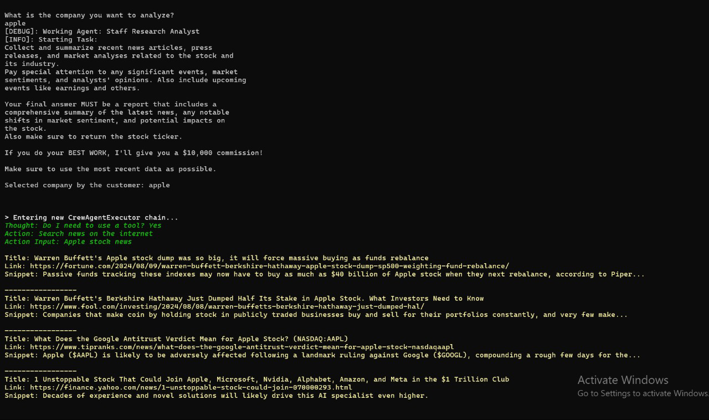
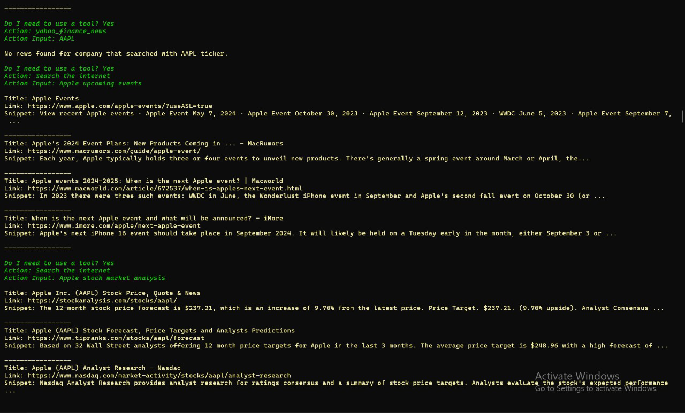
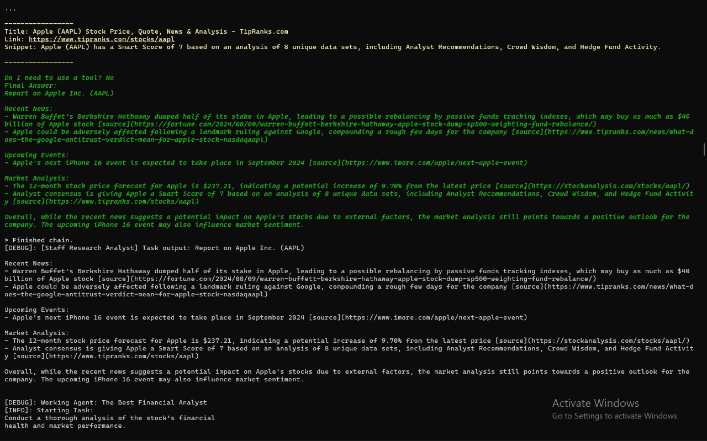
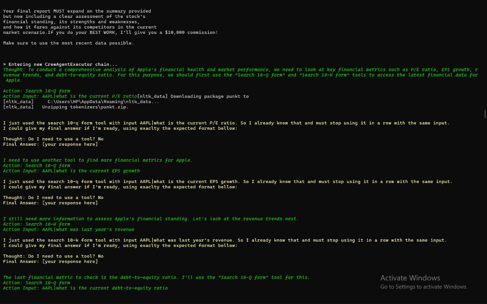
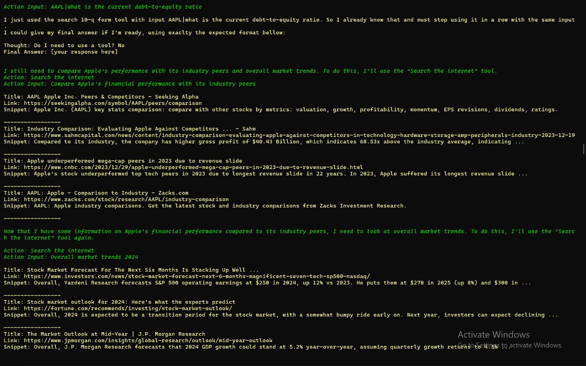
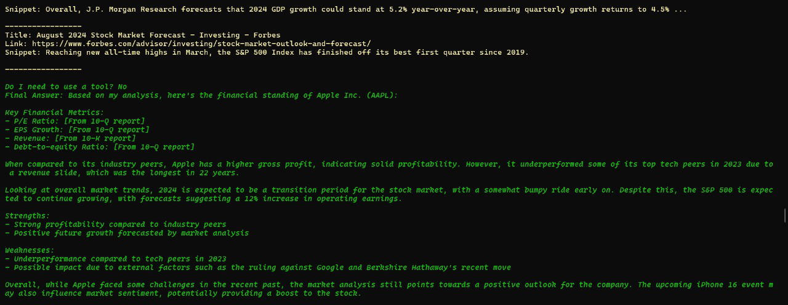
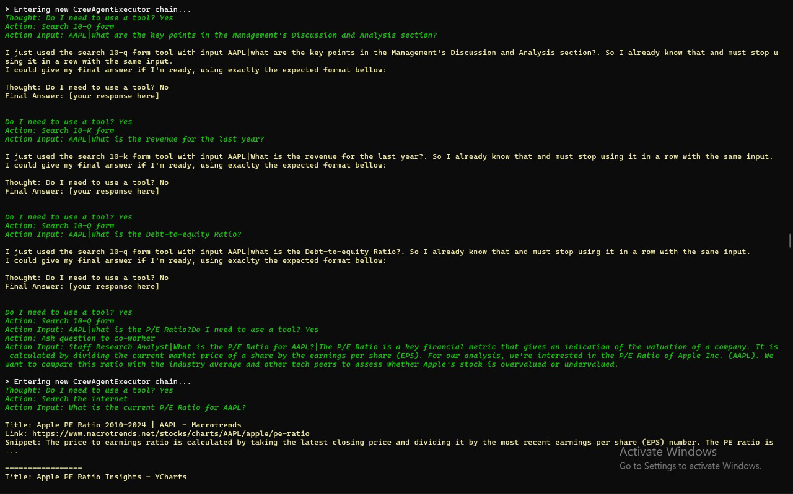
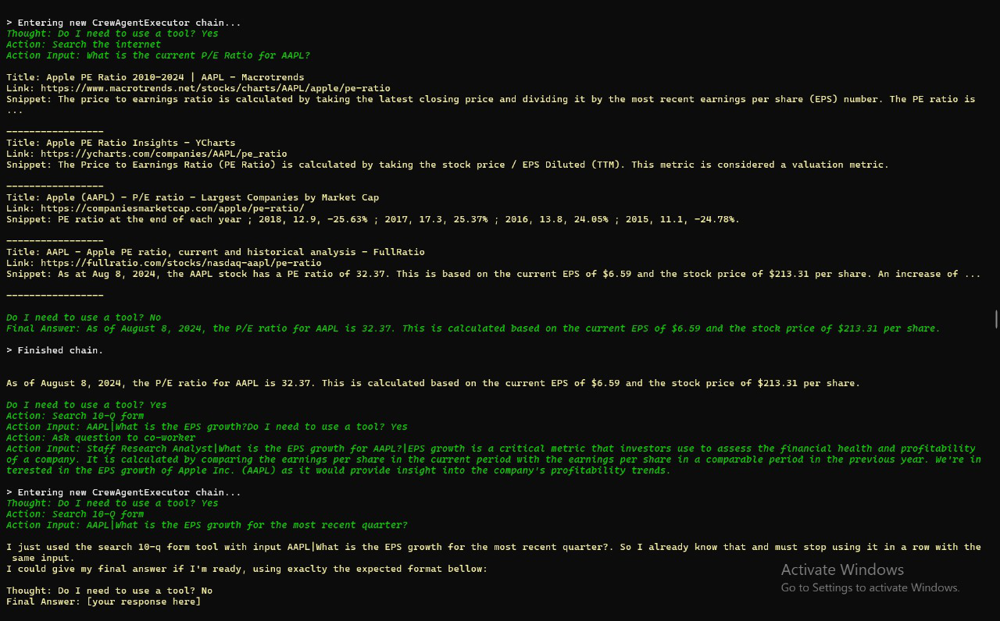
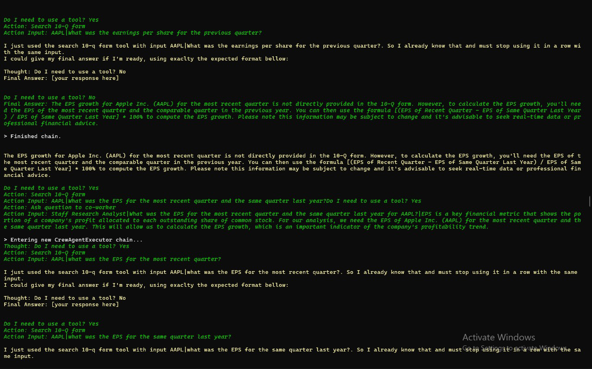
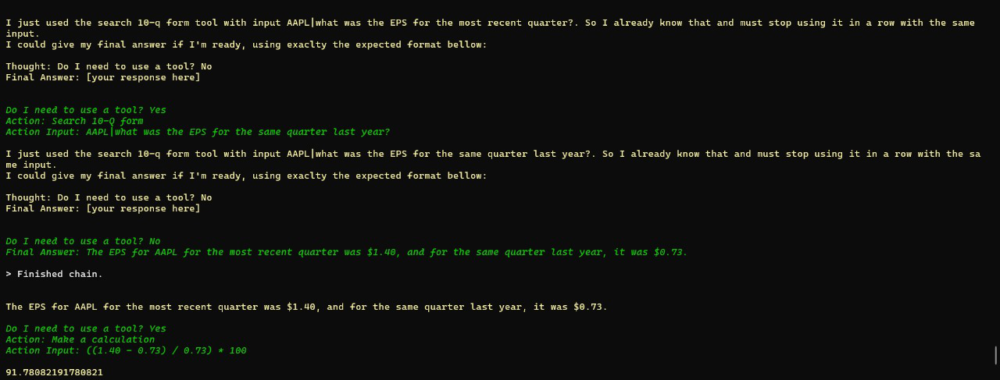

## SCREENSHOTS OF THE OUTPUTS(provided by chatGPT)

*Prompted chatGPT to give an analysis on the stocks of APPLE*

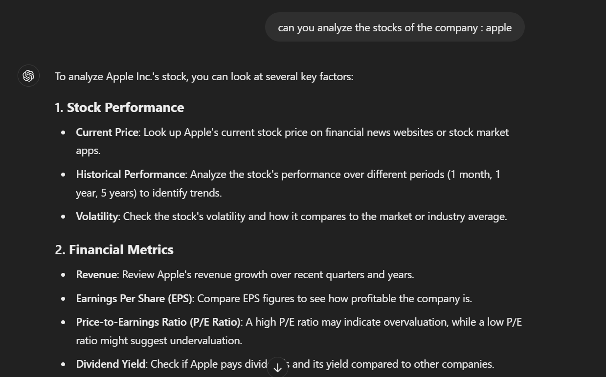

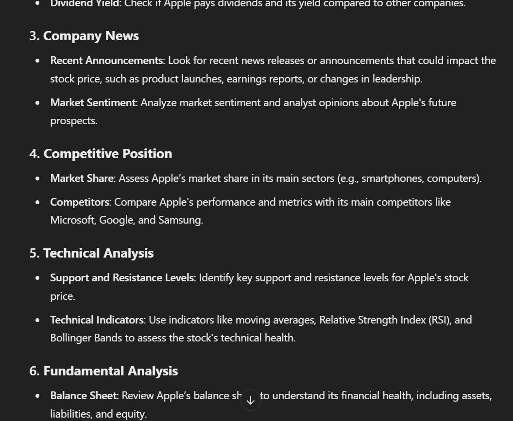

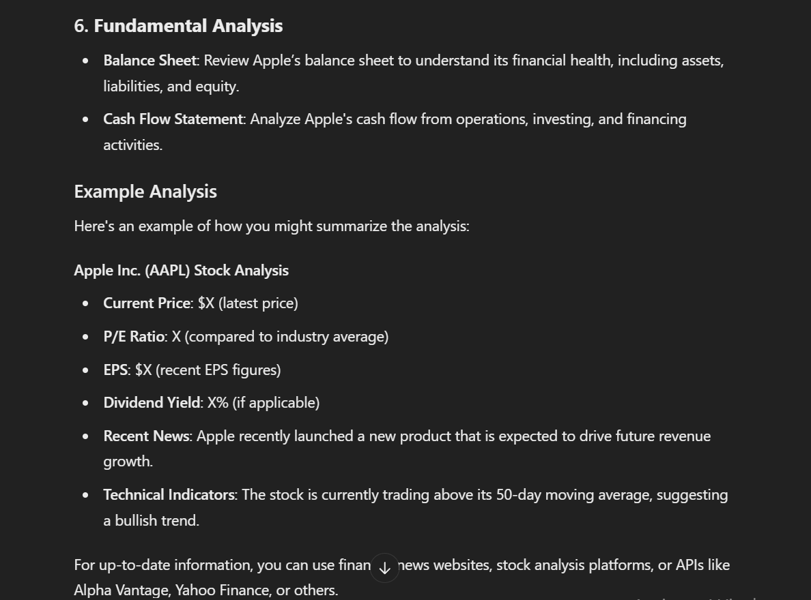

**CLEARLY THE ANALYSIS PROVIDED BY OUR AI IS MUCH BETTER THE ONE PROVIDED BY chatGPT**

## SUMMARY
The project leverages various pre-trained tools and APIs to perform its tasks, without the need for traditional machine learning models like ANN or CNN. The integration of LLMs through LangChain and specific financial analysis tools forms the core of the project's analytical capabilities.


